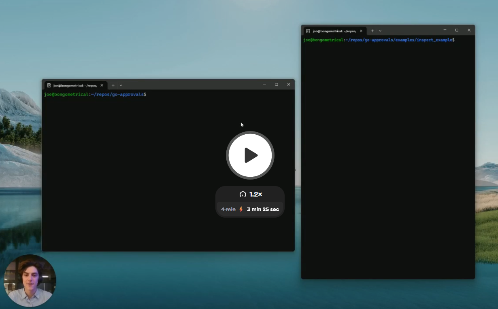

# Sentinel 
Sentinel is an agent control plane that allows you to efficiently oversee thousands of agents running in parallel.

<div align="center">
<a target="_blank" href="https://www.loom.com/share/c939b9c0da07421b8a3dd665cac26fda"></a>
</div>

We're starting with manual reviews for agent actions, but we'll add ways to automatically approve known safe actions in the future.

## Getting Started

This repo contains a simple web server written in Go and a React frontend. The frontend connects to the server via a websocket and displays reviews that need to be approved. Reviews are submitted to the server via the `/api/review` endpoint, and their status is polled from the `/api/review/status` endpoint.

From the root of the repo:

1. Start the webserver and frontend with docker compose:
```bash
cp .env.example .env # Set the environment variables in the .env file
source .env          # Pick up the environment variables
docker compose up    # Start the server and frontend
```

## Examples
Any agent can be run through Sentinel by sending a review to the `/api/review` endpoint and then checking the status of the review with the `/api/review/status` endpoint. Below we show an example of how to do this using curl, and then an example of how to Sentinel with AISI's Inspect framework.

### [1] Send a review to the interface using curl

1. Send a review to the interface via the `/api/review` endpoint:

```bash
curl -X POST http://localhost:8080/api/review \
     -H "Content-Type: application/json" \
     -d @examples/curl_example/payload.json
```
2. Check the status of the review programmatically with the `/api/review/status` endpoint:

```bash
curl http://localhost:8080/api/review/status?id=request-123
```
(replacing `request-123` with the ID of the review you submitted)

3. Navigate to http://localhost:3000 to see the review you submitted and to approve or reject it.


### [2] Run the Inspect example
Inspect is an agent evaluation framework that allows you to evaluate and control agents. We have an example of how to use Inspect with Sentinel [here](examples/inspect_example/README.md).

1. Make sure Inspect AI is installed in your python environment:

   ```bash
   pip install inspect-ai
   ```

2. Change to the example directory:

   ```bash
   cd examples/inspect_example
   ```

3. Run the example:

   ```bash
   inspect eval run.py --approval approval.yaml --model openai/gpt-4o --trace
   ```
This will run the example and trigger the approvals. The example in approval.py is choosing random tasks to run from the list of tasks (e.g. build a web app, build a mobile app, etc). It then runs the task and triggers the approval configuration. You should see the approvals in the approval api interface at http://localhost:3000.

## Approval configuation
The approval configuration is in `approval.yaml`. We follow the Inspect AI format for the approval configuration. More information here: [https://inspect.ai-safety-institute.org.uk/approval.html](https://inspect.ai-safety-institute.org.uk/approval.html)

Make sure the human api approval_api_endpoint is set to the local approval api endpoint.


In the `approval.yaml` example we have bash, python and human approval. Bash approval is done by checking if the command is in the allowed list. Python approval is done by checking if the modules and functions used are in the allowed list. If bash or python approval is not passed, the human approval is triggered. You can remove bash or python approval if you want escalate directly to human approval.

## Approval Configuration Details

The `approval.yaml` file contains the following configuration:

### Python Allowlist
- Allowed modules: requests, json, csv, datetime, re, math, random, time
- Allowed functions: print, len, range, str, int, float, list, dict, set, tuple, sum, max, min
- Disallowed builtins: eval, exec, compile, __import__, open, input
- Sensitive modules: os, sys, subprocess, socket
- System state modification: Not allowed

### Bash Allowlist
- Allowed commands: ls, cd, pwd, echo, cat, grep, mkdir, cp, wget, curl, pip
- Sudo: Not allowed
- Command-specific rules for pip: install, list, show

### Human API
- Applies to all tools
- Approval API endpoint: http://localhost:8080
- Agent ID: sample_3
- Number of approvals required: 5

This configuration ensures that only approved Python modules and functions, as well as specific bash commands, can be used without triggering human approval. Any attempts to use disallowed or sensitive operations will require human intervention through the specified API endpoint.


